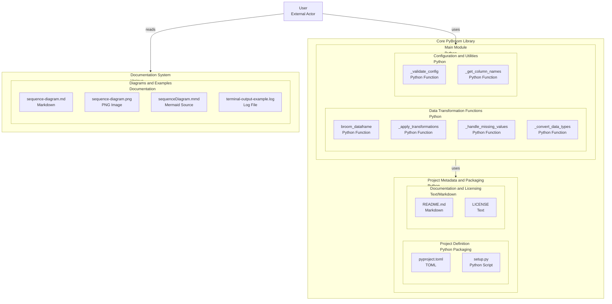

```mermaid
graph TD

    10["User<br>External Actor"]
    subgraph 1["Documentation System<br>Various"]
        subgraph 2["Diagrams and Examples<br>Documentation"]
            21["sequence-diagram.md<br>Markdown"]
            22["sequence-diagram.png<br>PNG Image"]
            23["sequenceDiagram.mmd<br>Mermaid Source"]
            24["terminal-output-example.log<br>Log File"]
        end
    end
    subgraph 3["Core PyBroom Library<br>Python"]
        subgraph 4["Project Metadata and Packaging<br>Python"]
            subgraph 5["Documentation and Licensing<br>Text/Markdown"]
                19["README.md<br>Markdown"]
                20["LICENSE<br>Text"]
            end
            subgraph 6["Project Definition<br>Python Packaging"]
                17["pyproject.toml<br>TOML"]
                18["setup.py<br>Python Script"]
            end
        end
        subgraph 7["Main Module<br>Python"]
            subgraph 8["Configuration and Utilities<br>Python"]
                15["_validate_config<br>Python Function"]
                16["_get_column_names<br>Python Function"]
            end
            subgraph 9["Data Transformation Functions<br>Python"]
                11["broom_dataframe<br>Python Function"]
                12["_apply_transformations<br>Python Function"]
                13["_handle_missing_values<br>Python Function"]
                14["_convert_data_types<br>Python Function"]
            end
        end
        %% Edges at this level (grouped by source)
        7["Main Module<br>Python"] -->|uses| 4["Project Metadata and Packaging<br>Python"]
    end
    %% Edges at this level (grouped by source)
    10["User<br>External Actor"] -->|reads| 1["Documentation System<br>Various"]
    10["User<br>External Actor"] -->|uses| 7["Main Module<br>Python"]
```